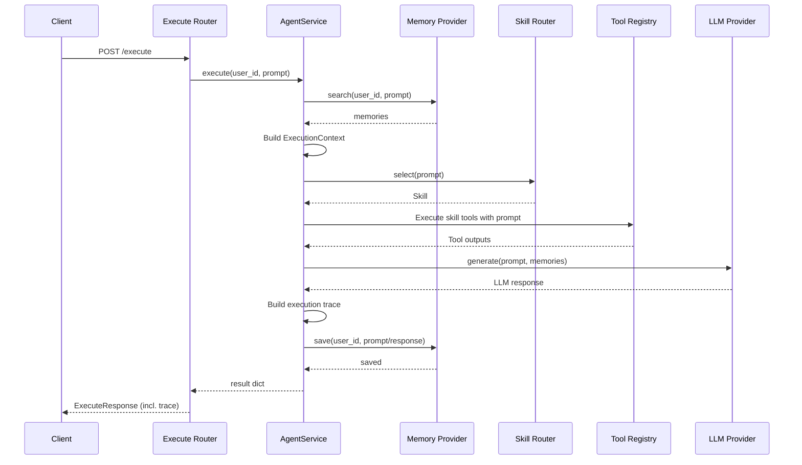

# Agent Factory Architecture

Permanent architectural reference for this repository.

Current as of commit `4eed39d` on `main` (2026-08-31). Mechanisms,
boundaries, and rules in this document are durable; statements about
current inventories (registered providers, skill list, wiring status)
are snapshots from that commit and will drift as the repository evolves.

Related documents:

- `AGENTS.md` — working rules for AI agents changing this repository;
  authoritative for change conventions.
- `docs/architecture/api-contract.md` — partially stale. It describes
  endpoints (`/api/chat`, `/api/providers`) that are planned, not
  implemented. This document supersedes it for implemented behavior.
- `docs/architecture/future-architecture.md` and
  `keep-replace-remove.md` — forward-looking proposals. See §13 for
  known conflicts with them.

When documentation and code disagree, the code is authoritative.

---

## 1. Purpose and Scope

Agent Factory is a FastAPI starter for building AI agent platforms.

The current implementation provides a deterministic, observable agent
execution slice:

```text
prompt → memory search → skill selection → tool execution
       → LLM provider → execution trace → memory save
```

The primary execution entry point is `POST /execute`.

The repository contains **two coexisting execution architectures**:

1. **Next-generation AgentService/provider architecture** — active,
   used by `POST /execute`.
2. **Legacy adapter/execution-service architecture** — retained, not
   wired to any router.

These two architectures must not be mixed within a single execution
path.

The architecture is organized around: registries, provider
abstractions, deterministic skills and tools, request-scoped execution
context, and typed API responses.

### Design principles

- **Deterministic orchestration** — skill selection and tool execution
  are deterministic and testable.
- **Provider abstraction** — orchestration does not depend on concrete
  LLM or memory implementations.
- **Registry-based extensibility** — providers, tools, and skills are
  added through explicit registration points.
- **Typed contracts** — Pydantic models define the API and trace
  boundary, shared with the web UI.
- **Observable execution** — the response trace exposes how an answer
  was produced.
- **Testability without live AI** — mock providers let the full
  pipeline run without external model services.

---

## 2. Execution Model

The active execution sequence, as implemented by `AgentService`
(`apps/api/services/agent_service.py`):



The intentional high-level sequence is:

```text
memory.search
    ↓
ExecutionContext
    ↓
skill selection
    ↓
tool execution
    ↓
LLM generation
    ↓
trace construction
    ↓
memory.save
```

This sequence is marked intentional in code and should not be changed
casually.

---

## 3. Repository Layout

```text
apps/
  api/
    main.py               # App entrypoint; mounts routers + /ui static files
    routers/              # Thin HTTP boundary
    services/             # Business logic and orchestration
    skills/               # Skill definitions + deterministic router
    tools/                # Deterministic tools
    providers/            # Active provider world
      llm/                # LLM abstraction + implementations
      memory/             # Memory abstraction + implementations
      storage/            # Frozen scaffolding (ADR-015), no registry, not wired
      analytics/          # Frozen scaffolding (ADR-015), no registry, not wired
      butterbase/         # Wired via /butterbase router (no registry)
      evermind/           # Client used by the evermind memory provider
      nebius/             # Empty client placeholder
    adapters/             # Legacy backend adapters
    memory/               # Legacy memory stores
    models/               # Pydantic API and trace contracts
    core/                 # ExecutionContext + typed error hierarchy
    config/               # pydantic-settings (reads apps/api/.env)
    repositories/         # Placeholder repository layer (unwired)
    tests/                # Top-level unit + nextgen/, legacy/,
                          # integration/, benchmarks/
  web/                    # Static demo UI (index.html) served at /ui
benchmarks/               # Standalone benchmark harness (runner/, tasks/)
docs/architecture/        # This document + ADRs
.github/workflows/        # CI
```

### Component responsibilities

| Area            | Responsibility                                                  |
| --------------- | --------------------------------------------------------------- |
| `routers/`      | HTTP/API boundary                                               |
| `services/`     | Business logic and orchestration                                |
| `skills/`       | Skill definitions and deterministic routing                     |
| `tools/`        | Deterministic operations available to skills                    |
| `providers/`    | Active provider abstractions and implementations                |
| `adapters/`     | Legacy backend abstraction                                      |
| `memory/`       | Legacy memory implementations                                   |
| `models/`       | Pydantic API and trace contracts                                |
| `core/`         | Execution context and typed errors                              |
| `config/`       | Application configuration                                       |
| `repositories/` | Placeholder persistence layer (stub, unwired)                   |
| `tests/`        | Unit, next-generation, integration, benchmark, and legacy tests |
| `benchmarks/`   | Standalone benchmark harness                                    |
| `web/`          | Static API-consuming demonstration UI                           |

---

## 4. HTTP Boundary and API Contract

The FastAPI application is defined in `apps/api/main.py`.

### Routes

```text
GET  /                   # Root info message
GET  /health             # Health check
POST /execute            # Primary agent execution endpoint
/butterbase/*            # Butterbase storage service proxy
/ui                      # Static demo UI
/docs, /openapi.json     # FastAPI defaults
```

### Router responsibilities

Routers should:

- validate HTTP input through Pydantic models;
- invoke services;
- return typed responses.

Routers should not:

- contain business orchestration;
- select providers directly;
- implement memory behavior;
- execute tools directly;
- contain provider-specific logic.

### The execute contract

```text
ExecuteRequest
├── prompt: str
├── backend: str = "mock"
└── user_id: str | None = None

ExecuteResponse
├── status: str
├── backend: str
├── prompt: str
├── output: str
├── memory_count: int
└── trace: ExecutionTrace | None
```

Contract behaviors worth knowing:

- The router resolves defaults from `model_fields_set`, not the
  Pydantic defaults: an omitted `user_id` becomes `"anonymous"` and an
  omitted `backend` becomes `"agent-service"`.
- The response `backend` echoes the requested backend; it is not the
  skill backend actually resolved during execution.
- `/butterbase/*` additionally uses the `ConversationCreate` model.

`ExecuteRequest` / `ExecuteResponse` / `ExecutionTrace` are a shared
backend/UI contract consumed by `apps/web`. Changes require
corresponding test and UI updates.

---

## 5. Active Pipeline

### AgentService

`AgentService` (`apps/api/services/agent_service.py`) is the primary
orchestration layer. It coordinates the execution components without
embedding provider, skill, or tool implementation details.

Responsibilities:

- retrieving relevant memory;
- validating the memory result (a non-iterable result raises
  `InvalidMemoryDataError`);
- creating request-scoped execution context;
- selecting a skill;
- executing the selected skill's tools;
- resolving the appropriate LLM provider;
- generating the response;
- constructing the execution trace;
- saving the resulting interaction;
- translating failures into typed agent-service errors.

Provider construction happens at init (memory and LLM from settings);
per-request LLM resolution is driven by the selected skill's `backend`
(§7). Storage and analytics steps exist as commented-out hooks only
(§13).

### ExecutionContext

`apps/api/core/execution_context.py` defines a request-scoped
container for execution state:

```text
user_id, agent_id, session_id, conversation_id,
model, provider, task, metadata
```

The active execution path currently relies on `user_id`, `task`, and
`metadata` (which carries `skill` and `tool_outputs`).

`with_metadata()` and `set_routing()` return new context instances
rather than mutating; `to_dict()` produces a JSON-friendly form. This
is an effectively immutable execution-state model.

ExecutionContext exists so execution metadata (identity, agent info,
session/conversation identifiers, routing, model/provider selection)
has one structured home instead of being threaded through every layer
individually.

### Error handling

Agent-service failures use the typed hierarchy in
`apps/api/core/errors.py`:

```text
AgentServiceError
├── ProviderInitError
├── MemoryProviderError
│   ├── MemorySearchError
│   └── MemorySaveError
├── LLMProviderError
├── InvalidMemoryDataError
└── InvalidLLMResponseError
```

An intentional decision (documented in code): an LLM response of
`None` is a hard error (`InvalidLLMResponseError`), not silently
converted into an empty response. See ADR-008 for the recorded
decision and its rejected alternative.

Typed errors let the service layer communicate failures without
routers understanding provider-specific failure mechanisms.

**Error → HTTP mapping (ADR-014):** a single exception handler
registered in `main.py` maps every `AgentServiceError` to HTTP 500
with a typed `ErrorResponse` body (`error_type`, `detail`; defined in
`models/error_models.py`). The success contract (`ExecuteResponse`) is
unchanged, and Pydantic validation errors remain 422. Differentiated
status codes per error subclass are explicitly deferred.

---

## 6. Execution Trace

Tracing is part of the API response (see ADR-011 for the contract
decision). The schema family lives in
`apps/api/models/response_models.py`:

```text
ExecutionTrace
├── context: ContextTrace            (required)
├── skill: str
├── skill_selection: SkillSelectionTrace
├── tool: ToolTrace                  (single tool)
├── tools: [ToolExecutionTrace]      (per-tool detail)
├── llm: LLMTrace                    (required)
├── memory: MemoryTrace
├── trace_id, timestamp, total_duration_ms, status
```

`AgentService` builds the trace from real execution values and
currently populates a subset of the schema:

- `context` — user_id and task;
- `skill` — the selected skill name;
- `tool` — the **first** executed tool only (name + output);
- `llm` — the resolved backend name and the generated output.

The remaining fields (`tools[]`, `skill_selection`, `memory`, timing,
`trace_id`) are forward-looking schema that the active path does not
yet fill.

The trace makes execution observable: instead of returning only
`prompt → response`, the API exposes how the response was produced.
This is the foundation for debugging, evaluation, and benchmarks.

---

## 7. Extension Points and Registries

Registries are the recurring extensibility pattern. They separate
**selection** from **implementation**: a skill can declare
`backend = "mock"` without knowing how the mock provider is
constructed; a skill can declare `tools = ["calculate"]` without
constructing the tool.

New providers, tools, and skills are added by implementing the
existing base classes and registering them in the matching registry
(see `AGENTS.md` for the rule).

### Skills

- Model: Pydantic `Skill` in `apps/api/skills/skill.py` —
  `name`, `backend`, `tools`, `description`, `keywords`, `priority`.
- Registry: a list in `apps/api/skills/registry.py` (current
  inventory in §10).
- Routing (`apps/api/skills/router.py`): case-insensitive keyword
  substring matching; each match scores 1, plus `priority * 0.1` as a
  tie-breaker **only among skills that matched at least one keyword**.
  Priority never causes selection on its own.
- Fallback is **positional**: `skills[0]` when nothing matches. It is
  not a lookup for the skill named `default` (the registry happens to
  contain one). Recorded as ADR-009.

A skill describes both what capability should execute and which
backend provides its LLM response.

### Tools

- Abstraction: `BaseTool.execute(input_text) -> str` — synchronous and
  deterministic.
- Registry: `apps/api/tools/registry.py`, name → tool instance.
- Execution: after skill selection, `AgentService` runs each tool the
  skill lists, passing the raw prompt as input, and stores the outputs
  in the context metadata.

The registry separates "what tools exist" from "which tools this
skill uses", making tools independently discoverable, testable, and
reusable across skills.

### LLM providers

- Abstraction: `LLMProvider` in `apps/api/providers/llm/base.py` —
  async `generate(prompt, memories) -> str`.
- Registry: `apps/api/providers/llm/registry.py`, name → provider
  class, instantiated on demand.
- Resolution: the selected skill's `backend` names the provider. When
  that backend equals `settings.llm_provider`, the provider built at
  service init is reused; otherwise it is resolved from the registry.

This keeps orchestration independent of the concrete LLM
implementation.

### Memory providers

- Abstraction: `MemoryProvider` in `apps/api/providers/memory/base.py`
  — async `save(user_id, data)` and `search(user_id, query)`.
- Registry: `apps/api/providers/memory/registry.py`, a registry of
  **factories** so optional dependencies can be imported lazily.
- Selected via `settings.memory_provider`. The optional-dependency
  boundary for mem0 is recorded as ADR-010.

The active pipeline depends on the `MemoryProvider` abstraction, never
on a concrete memory implementation.

### Butterbase: a wired provider without a registry

`providers/butterbase/client.py` is consumed directly by the
`/butterbase` router. It is the only external-service provider wired
into the app that does not go through a registry.

---

## 8. Configuration

Configuration is centralized in `apps/api/config/settings.py`
(pydantic-settings), reading `apps/api/.env` (gitignored). All
settings have defaults, so the app runs without secrets.

Configuration surface:

| Setting                    | Default                     | Consumed by                     |
| -------------------------- | --------------------------- | ------------------------------- |
| `ollama_url`               | `http://localhost:11434`    | Ollama LLM provider/adapter     |
| `ollama_model`             | `qwen3:8b`                  | Ollama LLM provider/adapter     |
| `butterbase_api_base/_key` | `None`                      | Butterbase client               |
| `evermind_api_key`         | `None`                      | EverMind client                 |
| `nebius_api_key`           | `None`                      | Nothing currently (orphan key)  |
| `cerebras_api_key`         | `None`                      | Legacy cerebras adapter (gates registration) |
| `memory_provider`          | `evermind`                  | `AgentService` init             |
| `llm_provider`             | `ollama`                    | `AgentService` init             |
| `storage_provider`         | `local`                     | **Nothing currently** (frozen scaffolding, ADR-015) |
| `analytics_provider`       | `local`                     | **Nothing currently** (frozen scaffolding, ADR-015) |

Rules:

- Route all configuration through `settings.py`; no hard-coded URLs,
  keys, or provider choices in code.
- `.env` files and credentials are never committed.

`apps/api/.env.example` documents the available knobs (without
secrets) for copying to `apps/api/.env`.

Runtime requirements: Python ≥ 3.11. Optional extras: `.[dev]`
(pytest, ruff, black, mypy) and `.[mem0]` (the optional mem0 memory
provider dependency).

---

## 9. Legacy Architecture

The repository retains an older execution architecture, separate from
the active one.

### Components

```text
services/execution_service.py   # execute_agent()
adapters/registry.py            # AdapterRegistry
adapters/base_adapter.py        # BaseAdapter.execute(request, context) -> ExecuteResponse
memory/memory_manager.py        # module-level InMemory store
```

### Flow

```text
ExecuteRequest
    ↓
memory.load(user_id)            # legacy conversation memory
    ↓
select(request)                 # shared skill router
    ↓
backend = request.backend or skill.backend
    ↓
registry.get(backend) → BaseAdapter.execute(request, context)
    ↓
memory.save(user_id, prompt, result)
    ↓
ExecuteResponse (built by the adapter)
```

### Adapter registration

- `mock` and `ollama` are always registered.
- `cerebras` is registered only when `settings.cerebras_api_key` is
  set.
- `openai_adapter.py` and `snowflake_adapter.py` exist but are not
  registered.

### Status and known mismatch

This architecture is **not wired to any router** and does not drive
`POST /execute`.

Known mismatch at time of writing: `execute_agent` passes the
`ExecuteRequest` object to `skills.router.select()`, which expects a
prompt string, so the legacy path would fail at runtime if invoked.
Treat this as a legacy compatibility issue; do not silently "fix" it
during unrelated work.

Also note: legacy `memory/mem0_memory.py` imports `mem0` eagerly at
module top level (dormant module), in contrast to the active memory
registry's lazy-import boundary.

### Active vs. legacy

| Concern           | Active / next generation    | Legacy                  |
| ----------------- | --------------------------- | ----------------------- |
| Entry point       | `POST /execute`             | Not routed              |
| Orchestrator      | `AgentService`              | `ExecutionService`      |
| Providers         | `providers/`                | `adapters/`             |
| LLM abstraction   | `LLMProvider`               | `BaseAdapter`           |
| Memory            | `providers/memory/`         | `apps/api/memory/`      |
| Tool registry     | Central                     | Not used                |
| Execution context | `ExecutionContext`          | Plain conversation load |
| Trace             | `ExecutionTrace`            | None                    |
| Error model       | `AgentServiceError` family  | Unstructured            |

**Architectural rule:** do not combine components from the two columns
in a single execution path unless a migration is being deliberately
designed and tested. Recorded as ADR-012. The legacy pipeline's
disposition is now decided: it is slated for migrate-then-remove
(ADR-013), and the isolation rule remains in force until that
migration happens.

Superseded conflict: `keep-replace-remove.md` lists "Execution
Service" under **Keep**. ADR-013 supersedes that entry; the document
remains tagged Historical and preserved unedited (§13).

---

## 10. Wiring Status: Implemented vs. Registered vs. Wired

Three distinct states that this architecture must keep apart:

```text
implemented        code exists
registered         present in a registry / selectable
wired              reachable from the mounted application
```

Snapshot as of commit `4eed39d`:

| Component                          | Implemented | Registered          | Wired            |
| ---------------------------------- | ----------- | ------------------- | ---------------- |
| Skills: echo, web_search, calculator, default | yes | yes      | yes              |
| Tools: echo, web_search, calculate, summarize | yes | yes      | yes              |
| LLM: mock, ollama, fireworks       | yes         | yes                 | yes              |
| LLM: `cerebras.py`                 | yes         | no                  | no               |
| LLM: `capabilities.py` (ModelCapabilities) | yes | —               | no (unused)      |
| Memory: evermind                   | yes         | yes                 | yes (default)    |
| Memory: mem0                       | yes         | yes                 | needs `[mem0]` extra |
| Legacy adapters: mock, ollama      | yes         | yes                 | no (not routed)  |
| Legacy adapter: cerebras           | yes         | if API key set      | no (not routed)  |
| Legacy adapters: openai, snowflake | yes         | no                  | no               |
| Storage: base, local, butterbase   | stubs (broken, ADR-015) | no (no registry) | no |
| Analytics: base, local, snowflake  | stubs (broken, ADR-015) | no (no registry) | no |
| Butterbase client                  | yes         | — (no registry)     | yes (`/butterbase`) |
| EverMind client                    | yes         | —                   | yes (via memory provider) |
| Nebius client                      | empty file  | no                  | no (only a config key) |
| `routers/auth.py`, `services/auth_service.py`, `skill_service.py`, `memory_service.py`, `storage_service.py`, `model_router.py`, `repositories/base_repository.py` | empty files | — | no |
| `conversation_service.py` / `conversation_repository.py` | stubs | — | no |

The empty files are placeholders whose intended role is not
established; do not assume them to be part of the architecture (§13).

---

## 11. Testing and CI

### Test layout (`apps/api/tests/`)

| Area                 | Content                                                        |
| -------------------- | -------------------------------------------------------------- |
| top-level            | Unit/contract tests: `test_execute.py`, `test_execute_contract.py`, `test_execute_validation.py`, `test_health.py`, `test_mock_adapter.py` |
| `nextgen/`           | Active AgentService/provider pipeline, including provider tests (`providers/llm/`, `providers/memory/`) |
| `legacy/`            | One skipped vestige: a test of a removed `AgentService.process_message` API. No live legacy-path coverage |
| `integration/`       | Requires external services (e.g. local Ollama, Cerebras); marked `integration` |
| `benchmarks/`        | Wraps the standalone `benchmarks/` harness (`runner/`, `tasks/`) |

Configuration (`pyproject.toml`): `testpaths = ["apps/api/tests"]`,
`pythonpath = ["."]`, `addopts = "-m 'not integration'"` (integration
deselected by default). Async tests use `pytest-anyio`.

### Deterministic testing

Mock LLMs and mock backends exercise the full pipeline without live AI
providers. This is an architectural property: orchestration is testable
independently of external model availability.

### CI (`.github/workflows/tests.yml`)

On push/PR to `main`: Python 3.11, `pip install -e .`, then:

- `pytest -q --ignore=apps/api/tests/integration` — blocking;
- `ruff check .` — **non-blocking** (`continue-on-error: true`).

The repository therefore distinguishes fast deterministic validation
from external-service integration validation.

---

## 12. Architectural Boundaries

The intended dependency direction is:

```text
HTTP Router
    ↓
Service / Orchestrator
    ↓
Registries / Domain Components
    ↓
Provider Abstractions
    ↓
Concrete Providers
```

Boundaries:

- **Router boundary** — routers stay thin; they never call concrete
  providers directly.
- **Service boundary** — business orchestration belongs in services
  such as `AgentService`.
- **Provider boundary** — concrete LLM, memory, storage, analytics,
  and external-service implementations live behind provider
  abstractions.
- **UI boundary** — `apps/web` consumes the API only; it contains no
  backend provider or business logic.
- **Legacy boundary** — legacy adapters and memory must not leak into
  the active provider-based pipeline.
- **Configuration boundary** — all settings flow through
  `config/settings.py`.

`AGENTS.md` contains the corresponding working rules (what must not be
changed casually, commit conventions, verification steps); this
document records the architecture those rules protect.

---

## 13. Known Gaps and Open Questions

Items 2–4 were resolved on 2026-08-31 (ADR-013/014/015) and are
retained here for traceability; items 1 and 5 remain open.

1. **Empty placeholders.** `routers/auth.py`,
   `services/auth_service.py`, `skill_service.py`, `memory_service.py`,
   `storage_service.py`, `model_router.py`,
   `repositories/base_repository.py`, and `providers/nebius/client.py`
   are 0-byte files; `conversation_service.py` and
   `conversation_repository.py` are stubs. Their intended role is not
   established by the code.

2. ~~**Storage and analytics.**~~ Resolved by ADR-015 (2026-08-31):
   frozen scaffolding — kept in place, not wired, implemented, or
   deleted. The `storage_provider` / `analytics_provider` settings
   remain inactive.

3. ~~**Error → HTTP mapping.**~~ Resolved by ADR-014 (2026-08-31): a
   single exception handler maps every `AgentServiceError` to HTTP 500
   with a typed `ErrorResponse` body. Differentiated status codes per
   error subclass are explicitly deferred.

4. ~~**Legacy pipeline status.**~~ Resolved by ADR-013 (2026-08-31):
   the legacy pipeline is slated for migrate-then-remove. The
   `select()` signature mismatch (§9) is not fixed in place; it is
   carried into that migration. The "Keep" entry in
   `keep-replace-remove.md` is superseded; the historical document is
   preserved unedited.

5. **Stale contract doc.** `api-contract.md` describes unimplemented
   endpoints; it should be updated or explicitly marked superseded.

Future capabilities should extend through the existing abstractions
(define abstraction → implement → register → select → execute →
trace → test) rather than bypassing them. Speculative direction
belongs in `future-architecture.md`, not here.
